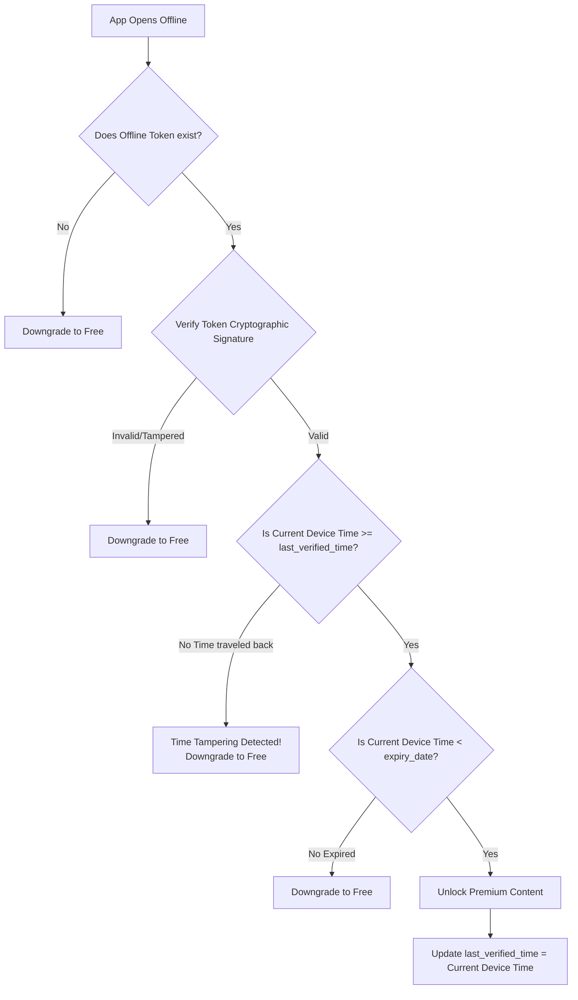

# Secure Offline Premium Architecture

This document details the algorithm for enforcing a mathematically secure offline subscription model for Spirox, combining Asymmetric Cryptography and Monotonic Time Tracking.

## Phase 1: Online Sync (Backend & Frontend)

1. **User opens app online:**
   The frontend connects to Supabase and requests the user's profile and subscription status.
2. **Backend Server signs the "Offline Token":**
   If the user has an active premium subscription, the backend creates a JSON payload containing `{"user_id": "123", "expiry_date": "2024-12-01"}`.
   The backend uses its secret **Private Key (RS256)** to cryptographically sign this payload into a JWT string.
3. **Frontend Caches State:**
   - The frontend receives the signed Offline Token and saves it to `localStorage`.
   - The frontend notes the true server time and saves it as `last_verified_time`.

## Phase 2: Offline Usage (The Verification Algorithm)

Every time the user opens the app while disconnected from the internet, the frontend runs this exact loop:

## Phase 3: Monotonic Time Tracking (Anti-Time Travel)

If the algorithm succeeds and grants premium, it immediately overwrites `last_verified_time` with the *current* device time. 
Because time must always move forward, if a user changes their phone clock backwards, the next time they open the app, the `Current Device Time` will be *smaller* than the `last_verified_time`. The app will instantly realize the user tampered with the clock and block Premium.

---

## Are there any loopholes left?

While this stops 99.9% of attacks (including LocalStorage editing and Phone Clock changes), here are the absolute final limits of software security:

### 1. The "Ghost Device" (Accepted Limitation)
**The Loophole:** A user subscribes on their Phone, downloads premium content, and puts their Phone in airplane mode. Then, they go to their Laptop and cancel the subscription for a refund. 
**The Result:** The Phone will retain Premium access until the exact `expiry_date` encoded in its offline token. We cannot remotely revoke it because the phone is offline.
**Why it's okay:** Spotify and Netflix accept this risk. It naturally self-resolves when the offline token's expiry date hits.

### 2. Reverse Engineering the Source Code (The Ultimate Hack)
**The Loophole:** Because Javascript executes on the user's device, a highly skilled hacker could download your website's source code, find the `if (verifySignature(token))` line, delete it, and replace it with `if (true)`. They would then host this modified "hacked" version of Spirox on their own local computer.
**Why it's okay:** It is a fundamental law of computer science that **you can never 100% trust the client**. If someone possesses the code, they can rewrite the code. However, this requires immense technical skill and effort, far beyond what any normal user would do for a meditation app.

### 3. The Slow Clock Hack
**The Loophole:** If a user doesn't turn the clock backwards, but instead slows the clock down (e.g., modifying the OS so that 1 real minute equals 1 second), the `last_verified_time` check won't catch it because time is still moving forward.
**Why it's okay:** This requires rooting/jailbreaking the phone and modifying deep operating system kernels.
